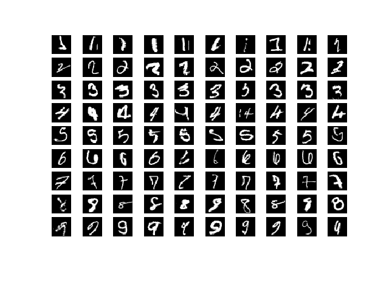
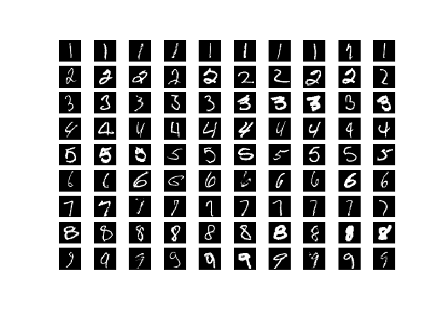

# uncertain-classifier
An image classifier that quantifies its uncertainty using Bayesian methods as described in Kendall and Gal (2017)


## Epistemic uncertainty
- Model is confused between two or more classes, i.e. the image is a digit but it's not clear which one.
- Can be fixed with more data.



## Aleatoric uncertainty
- Data is out-of-domain or the data is noisy.
- Cannot be fixed with more data




## Epistemic model
```
$ python3 train.py epistemic
$ python3 vis.py epistemic
```

## Aleatoric model
```
$ python3 train.py aleatoric
$ python3 vis.py aleatoric
```


## Combined model
```
$ python3 train.py combined
$ python3 vis.py combined
```
