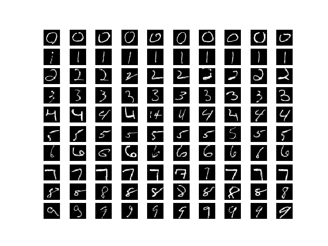
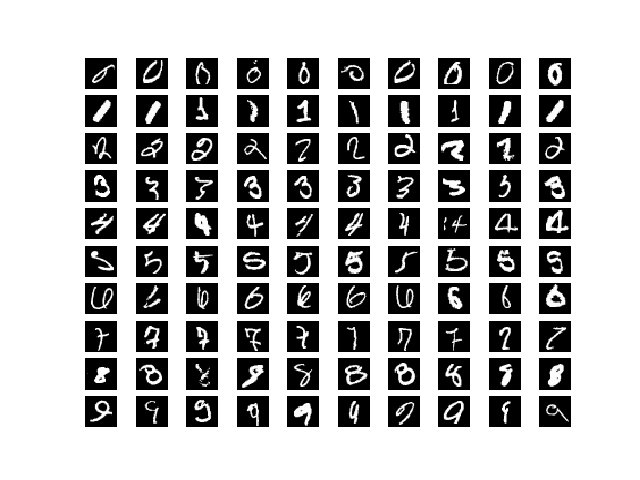

# uncertain-classifier
An image classifier that quantifies its uncertainty using Bayesian methods as described in Kendall and Gal (2017)

## Aleatoric uncertainty
- Data is out-of-domain or noisy i.e. the image is probably not a digit or image is not clear-enough
- Cannot be fixed with more data

## Epistemic uncertainty
- Model is confused between two or more classes, i.e. the image is a digit but it's not clear which one.
- Can be fixed with more data.

